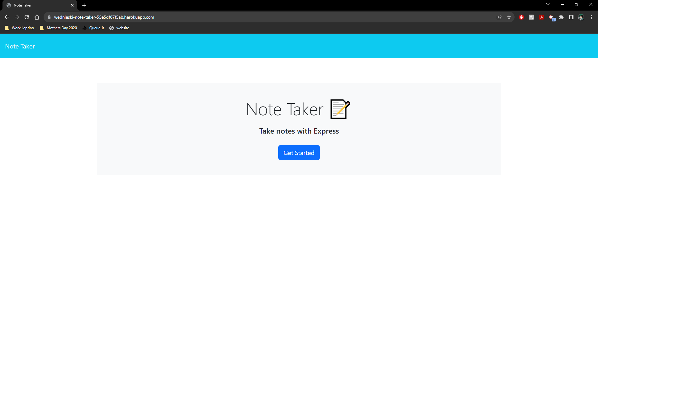
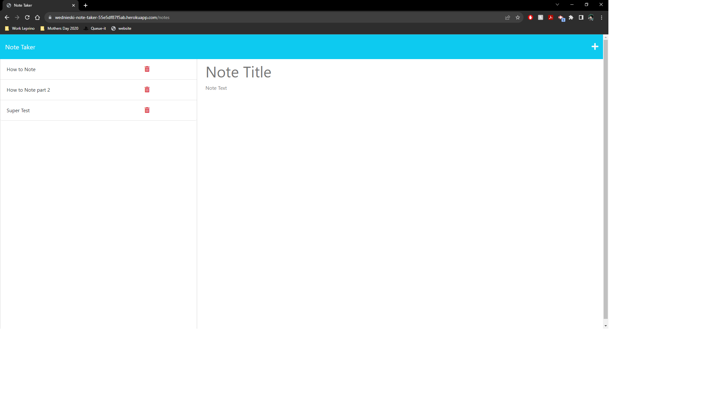

# Note Tracker

## Description

An application that uses an Express.js backend to save, update and delete notes that are saved to a JSON file

  ## Table of Contents
  * [Technology Stack](#technology-stack)
  * [User Story](#user-story)
  * [Acceptance Criteria](#acceptance-criteria)
  * [Installation](#installation)
  * [Screenshot](#screenshot)
  * [Deployed Page](#deployed-page)
  * [License](#license)

## Technology Stack


## User Story

```md
AS A small business owner
I WANT to be able to write and save notes
SO THAT I can organize my thoughts and keep track of tasks I need to complete
```

## Acceptance Criteria

```md
GIVEN a note-taking application
WHEN I open the Note Tracker
THEN I am presented with a landing page with a link to a notes  
page
WHEN I click on the link to the notes page
THEN I am presented with a page with existing notes listed in  
the left-hand column, plus empty fields to enter a new note title  
and the note’s text in the right-hand column
WHEN I enter a new note title and the note’s text
THEN a Save icon appears in the navigation at the top of the page
WHEN I click on the Save icon
THEN the new note I have entered is saved and appears in the left-hand  
column with the other existing notes
WHEN I click on an existing note in the list in the left-hand column
THEN that note appears in the right-hand column
WHEN I click on the Write icon in the navigation at the top of the page
THEN I am presented with empty fields to enter a new note title and the  
note’s text in the right-hand column
```

## Installation

  * Ensure you are running Node.js v16.  
  * Clone the repository.
  ```
    git clone git@github.com:iam3dski/note-taker.git
  ```
  * Install the dependencies.
  ```
    npm i
  ```
  * Start the application.
  ```
    npm start
  ```
  > View the application at: http://localhost:3000

## Screenshot





## Deployed page

[View Published Page](https://wednieski-note-taker-55e5df87f5ab.herokuapp.com/)

## License

  [](https://lbesson.mit-license.org/)